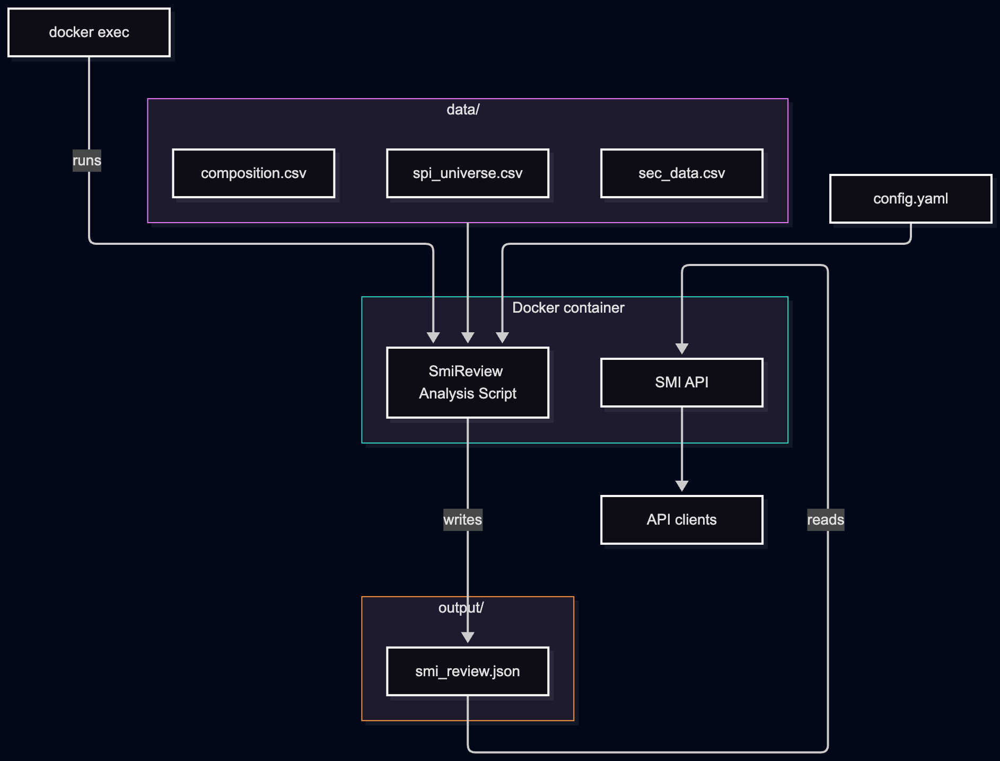

# SMI Review Index Project
## Component Architecture


## Prerequisites
> **Important:** `data` folder and `config.yaml` already created
### Input data

Create a `data` folder in the project root and add the following files:
```
data/
├── composition.csv
├── sec_data.csv
└── spi_universe.csv
```
**Notes**: 
+ `the data folder already included in deliverables`

## Configuration

Create a `config.yaml` file in the project root. It defines the review and cut-off dates, where to write the output, and how to read each input file (file paths, column names, and separators).

```yaml
review_date: "2026-09-21"   # date of the index review (YYYY-MM-DD)
cutoff_date: "2026-09-10"   # data cut-off date (YYYY-MM-DD)
output_path: output/smi_review.json

spi_universe:
  file_path: data/spi_universe.csv
  separator: ";"
  id_column: id
  date_column: date

sec_data:
  file_path: data/sec_data.csv
  separator: ";"
  id_column: id
  date_column: date
  price_column: price
  shares_column: shares
  free_float_column: free_float

comp:
  file_path: data/composition.csv
  id_column: id
```
**Notes:**
+ The column settings must match the header names in your CSV files. Paths are relative to the project root.
+ `config.yaml already included in the deliverables`

## Docker Installation

```bash
# Run docker compose
docker compose up -d --build
# Generate analysis dataset
docker exec smi_api python src/smi_index_review/main.py
```
Visit API Swagger: `http://localhost:8000/docs`

### API routes

| Method | Route             | Description                                                                              |
|--------|-------------------|------------------------------------------------------------------------------------------|
| GET    | `/smi/data`       | Latest SMI review result                                                                 |
| GET    | `/constituents`   | Index constituents with ID, free-float market cap rank, review status, and initial and capped weights |
| GET    | `/joiners`        | Securities entering the index at this review                                             |
| GET    | `/leavers`        | Securities leaving the index at this review                                              |
| GET    | `/dataset/schema` | Schema of the analysis dataset                                                           |

Interactive documentation for all routes is available at [http://localhost:8000/docs](http://localhost:8000/docs) once the service is running.

## Development

0. `Follow Steps in Configuration Section`

1. `Install Project Depedencies`
```bash
./install_deps.sh
```

2. `Generate SMI Dataset`
```bash
uv run src/smi_index_review/main.py
```

3. `Run SMI API`
```bash
uv run uvicorn smi_index_review.api.index:app --host 0.0.0.0 --port 8000 --reload 
```

4. `Linting`
```bash
./lint.sh
```

5. `Run Tests`
```bash
./run_tests
```
